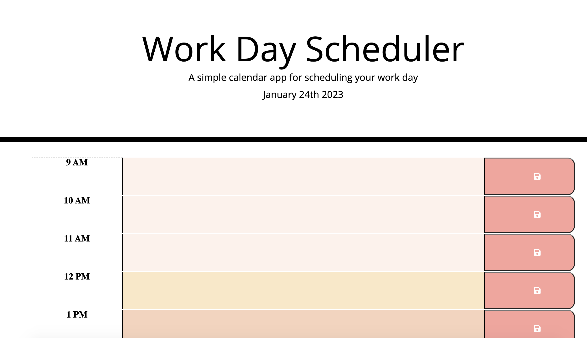

# Challenge7-WeeklyPlanner
 a simple calendar application that allows a user to save events for each hour of the day by modifying starter code.

## Links

https://helloseva.github.io/Challenge7-WeeklyPlanner/ 

## Description 

This week’s Challenge as a part of the bootcamp required to create a calendar application that allows a user to save events for each hour of the day by modifying starter code. The application should feature dynamically updated HTML and CSS powered by jQuery to allow each time-block to change color to indicate whether it is in the past, present, or future relative to the current hour when the user is on the application. DOM manipulation, advanced JavaScript, integration of third-party APIs have been implemented. Moment.js library used to work with date and time. The app:

- Displays the current day at the top of the calendar when a user opens the planner.
- Presents timeblocks for standard business hours when the user scrolls down.
- Color-code each timeblock based on past, present, and future when the timeblock is viewed.
- Allow a user to enter an event when they click a timeblock.
- Save the event in local storage when the save button is clicked in that timeblock.
- Persist events between refreshes of a page.

## Table of Contents (Optional)

* [Installation]
* [Usage]
* [License]

## Installation

1. Go To https://github.com/Helloseva/Challenge7-WeeklyPlanner 
2. Copy the Git clone link using SSH.
3. In terminal on your local device, clone the repository using Git clone.
4. Open in Visual Studio.

## Usage 

AS AN employee with a busy schedule
I WANT to add important events to a daily planner
SO THAT I can manage my time effectively

This page is about using DOM manipulation, advanced JavaScript skills, integration of third-party APIs skills to create a daily planner to manage time effectively.

Screeshot of the Web Page:

## Credits

N/A

## License

Please refer to the LICENSE in the repo.